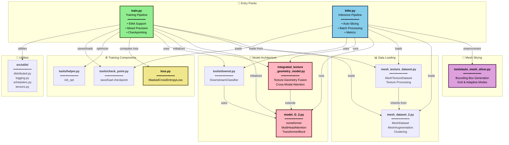
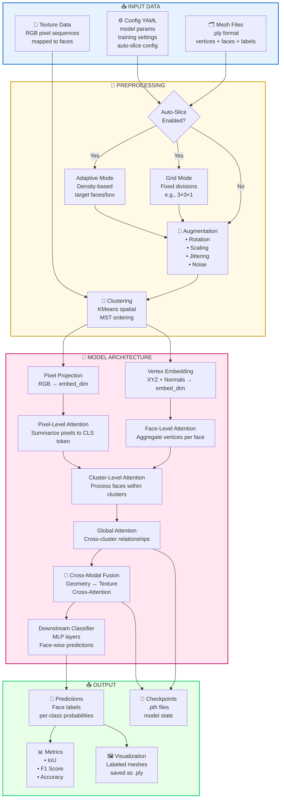
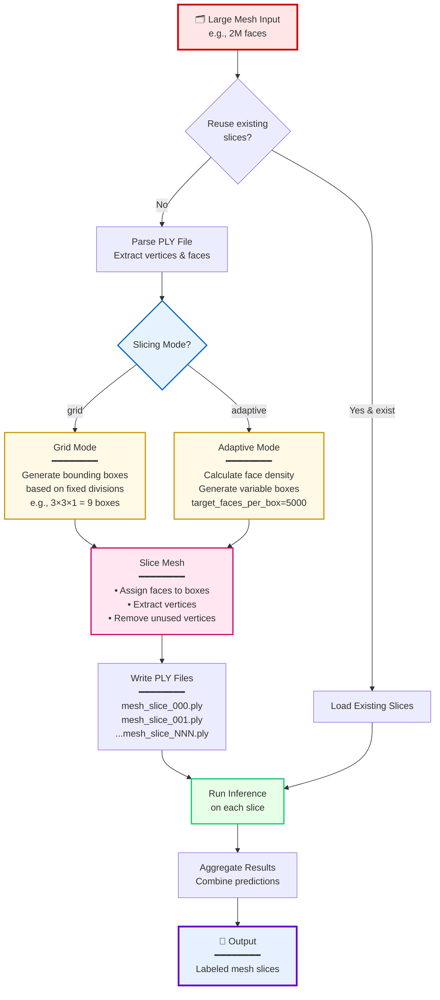

# 🧪 CHemiAI Repository Architecture Diagram

> **A PyTorch-based deep learning system for mesh analysis with texture-geometry integration and automatic mesh slicing**

---

## 📁 Complete Directory Structure

```
CHemiAI/
│
├── 📋 Project Configuration
│   ├── requirements.txt                          # Python dependencies
│   ├── config_inference_auto_slice_example.yaml  # Auto-slice inference config
│   ├── config_inference_with_slicing.yaml        # Standard slicing config
│   └── AUTO_SLICE_README.md                      # Auto-slicing documentation
│
├── 🚀 Entry Points
│   ├── train.py                                  # Main training script
│   │   ├─ EMA (Exponential Moving Average)
│   │   ├─ Mixed Precision Training (AMP)
│   │   ├─ Checkpoint Management
│   │   └─ Metrics: IoU, F1, Accuracy
│   │
│   └── Infer.py                                  # Inference & auto-slicing
│       ├─ Auto-slicing (grid/adaptive modes)
│       ├─ Batch prediction
│       └─ Result aggregation
│
├── 🧠 Core Models
│   ├── model_G_2.py                              # Transformer-based nomeformer
│   │   ├─ MultiHeadAttention                     # Self-attention with positional encoding
│   │   ├─ TransformerBlock                       # Attention + FFN with residual
│   │   ├─ VertexEmbedding                        # Embed vertices (XYZ + normals)
│   │   ├─ FaceEmbedding                          # Aggregate vertices to faces
│   │   └─ nomeformer                             # Main transformer architecture
│   │
│   └── integrated_texture_geometry_model.py      # Texture + Geometry fusion
│       ├─ TexturePatchEmbedding                  # Process RGB pixel sequences
│       ├─ IntegratedTextureGeometryModel         # Multi-modal fusion
│       │   ├─ Geometry Branch (vertices/faces)
│       │   ├─ Texture Branch (RGB pixels)
│       │   └─ Cross-Modal Attention
│       └─ IntegratedDownstreamClassifier         # Classification head
│
├── 📊 Data Processing
│   ├── mesh_dataset_2.py                         # Geometry dataset
│   │   ├─ MeshDataset                            # Load .ply meshes
│   │   ├─ MeshAugmentation                       # Rotation, scaling, jittering
│   │   ├─ compute_cluster_centroids              # Spatial clustering
│   │   ├─ reorder_clusters_by_proximity          # MST-based ordering
│   │   └─ custom_collate_fn                      # Batch collation
│   │
│   └── mesh_texture_dataset.py                   # Texture dataset
│       ├─ MeshTextureDataset                     # Load meshes + texture pixels
│       ├─ texture_custom_collate_fn              # Texture batch collation
│       └─ Inherits augmentation from mesh_dataset_2
│
├── 🛠️ Utilities & Tools
│   └── tools/
│       ├── __init__.py
│       ├── downst.py                             # Downstream classifier
│       │   └─ DownstreamClassifier               # MLP classifier head
│       │
│       ├── helper.py                             # Training helpers
│       │   └─ init_opt()                         # Optimizer initialization
│       │
│       ├── check_point.py                        # Model persistence
│       │   ├─ save_checkpoint()                  # Save model state
│       │   └─ load_checkpoint()                  # Load model state
│       │
│       └── auto_mesh_slicer.py                   # Mesh slicing system
│           ├─ parse_ply_file()                   # Read PLY format
│           ├─ generate_automatic_bounding_boxes() # Grid-based slicing
│           ├─ generate_adaptive_bounding_boxes() # Density-based slicing
│           ├─ slice_mesh_with_bounding_boxes()   # Extract mesh slices
│           └─ write_ply_file()                   # Write PLY format
│
├── 🔧 Source Components
│   └── src/
│       ├── train.py                              # Training loop utilities
│       ├── transforms.py                         # Data transformations
│       └── utils/
│           ├── distributed.py                    # Multi-GPU training
│           ├── logging.py                        # Training logs
│           ├── schedulers.py                     # LR schedulers
│           └── tensors.py                        # Tensor utilities
│
├── ⚙️ Loss Functions
│   └── loss.py
│       └─ MaskedCrossEntropyLoss                 # Handles variable-length sequences
│
└── 📦 Cache & Build
    └── __pycache__/                              # Python bytecode cache
```

---

## 🔗 Module Dependencies & Relationships



---

## 🔄 Complete Data Flow Pipeline



---

## 🏗️ Model Architecture Deep Dive

### 1️⃣ Geometry-Only Model (nomeformer)

```
Input: Mesh with N faces
    ↓
┌─────────────────────────────────────┐
│  Vertex Embedding Layer             │
│  Input: [B, C, F, V, 6]             │ B=batch, C=clusters,
│  (XYZ + Normals)                    │ F=faces, V=vertices
│  Output: [B, C, F, V, embed_dim]    │
└─────────────────────────────────────┘
    ↓
┌─────────────────────────────────────┐
│  Face-Level Transformer             │
│  • Multi-Head Self-Attention        │
│  • Aggregate V vertices → 1 face    │
│  • Output: [B, C, F, embed_dim]     │
└─────────────────────────────────────┘
    ↓
┌─────────────────────────────────────┐
│  Cluster-Level Transformer          │
│  • Process F faces within cluster   │
│  • Local spatial relationships      │
│  • Output: [B, C, F, embed_dim]     │
└─────────────────────────────────────┘
    ↓
┌─────────────────────────────────────┐
│  Global Transformer                 │
│  • Cross-cluster attention          │
│  • Learn global structure           │
│  • Output: [B, C, F, embed_dim]     │
└─────────────────────────────────────┘
    ↓
┌─────────────────────────────────────┐
│  Downstream Classifier              │
│  • MLP layers                       │
│  • Output: [B, C, F, num_classes]   │
└─────────────────────────────────────┘
```

### 2️⃣ Integrated Texture-Geometry Model

```
                    Input Mesh
                        │
        ┌───────────────┴───────────────┐
        ↓                               ↓
┏━━━━━━━━━━━━━━━━━━━┓         ┏━━━━━━━━━━━━━━━━━━━┓
┃ GEOMETRY BRANCH   ┃         ┃  TEXTURE BRANCH   ┃
┃ ───────────────── ┃         ┃  ───────────────  ┃
┃ Vertices (XYZ)    ┃         ┃  RGB Pixels       ┃
┃ Normals           ┃         ┃  per Face         ┃
┃ [B,C,F,V,6]       ┃         ┃  [B,C,F,P,3]      ┃
┗━━━━━━━━━━━━━━━━━━━┛         ┗━━━━━━━━━━━━━━━━━━━┛
        ↓                               ↓
    Vertex                          Pixel
    Embedding                       Projection
    [embed_dim]                     [embed_dim]
        ↓                               ↓
    Face-Level                      Local
    Attention                       Attention
    (agg vertices)                  (CLS token)
        ↓                               ↓
┌───────────────────────────────────────────┐
│     [B,C,F,embed_dim]   [B,C,F,embed_dim] │
└───────────────────────────────────────────┘
                        │
                        ↓
        ┏━━━━━━━━━━━━━━━━━━━━━━━━━━━━━━┓
        ┃  CROSS-MODAL FUSION          ┃
        ┃  ──────────────────────────  ┃
        ┃  • Geometry-to-Texture Attn  ┃
        ┃  • Texture-to-Geometry Attn  ┃
        ┃  • Feature Concatenation     ┃
        ┗━━━━━━━━━━━━━━━━━━━━━━━━━━━━━━┛
                        ↓
                [B,C,F,2*embed_dim]
                        ↓
        ┌───────────────────────────┐
        │  Projection to embed_dim  │
        └───────────────────────────┘
                        ↓
                [B,C,F,embed_dim]
                        ↓
        ┌───────────────────────────┐
        │  Cluster Transformer      │
        │  Global Transformer       │
        └───────────────────────────┘
                        ↓
        ┌───────────────────────────┐
        │  Integrated Classifier    │
        └───────────────────────────┘
                        ↓
                [B,C,F,num_classes]
```

---

## 🔪 Auto-Slicing System Workflow



---

## 📦 Dependencies (requirements.txt)

```bash
# Deep Learning Framework
torch>=2.0.0              # Core deep learning
torchvision>=0.15.0       # Vision utilities
tensorboard>=2.13.0       # Training visualization

# Mesh Processing
trimesh>=3.23.0           # 3D mesh manipulation
networkx>=2.8.0           # Graph operations (trimesh dependency)

# Numerical Computing
numpy>=1.24.0             # Array operations
scipy>=1.10.0             # Scientific computing (KDTree, MST)

# Machine Learning
scikit-learn>=1.3.0       # KMeans clustering

# Metrics and Evaluation
pytorch-ignite>=0.4.11    # IoU, ConfusionMatrix
torchmetrics>=1.0.0       # F1 Score, Accuracy

# Configuration
pyyaml>=6.0               # YAML config parsing

# Progress Bars
tqdm>=4.65.0              # Training progress

# Image Processing
Pillow>=10.0.0            # PIL for image handling

# Utilities
glob2>=0.7                # File pattern matching
```

### Installation

```bash
# Install all dependencies
pip install -r requirements.txt

# Or with conda
conda install --file requirements.txt
```

---

## 🎯 Key Features & Capabilities

### ✨ Auto-Slicing System
| Feature | Description |
|---------|-------------|
| **Problem** | Large meshes (>1M faces) cause OOM errors |
| **Solution** | Automatic spatial decomposition into manageable chunks |
| **Grid Mode** | Fixed spatial divisions (e.g., 3×3×1 = 9 slices) |
| **Adaptive Mode** | Density-based slicing (target faces per box) |
| **Reusability** | Slices saved and reused across inference runs |
| **Vertex Cleanup** | Removes unused vertices for memory efficiency |

### 🎨 Texture-Geometry Integration
| Component | Function |
|-----------|----------|
| **Dual Processing** | Separate branches for geometry and texture |
| **Pixel Embeddings** | Converts RGB pixel sequences to embeddings |
| **Cross-Modal Attention** | Geometry ↔ Texture feature fusion |
| **CLS Token Pooling** | Summarizes pixel sequences per face |

### 🚀 Training Infrastructure
| Feature | Benefit |
|---------|---------|
| **EMA** | Exponential Moving Average for stability |
| **Mixed Precision** | Faster training with AMP (Automatic Mixed Precision) |
| **Checkpointing** | Resume training from saved states |
| **Multi-GPU** | Distributed training support |
| **Augmentation** | Rotation, scaling, jittering for robustness |

### 📊 Evaluation Metrics
- **IoU (Intersection over Union)** - Segmentation overlap
- **F1 Score** - Harmonic mean of precision/recall
- **Accuracy** - Overall classification correctness
- **Confusion Matrix** - Per-class performance

---

## 🚀 Quick Start Guide

### 1️⃣ Installation

```bash
# Clone repository
cd CHemiAI

# Install dependencies
pip install -r requirements.txt
```

### 2️⃣ Training

```bash
# Train geometry-only model
python train.py --config config_train_geometry.yaml

# Train integrated texture-geometry model
python train.py --config config_train_integrated.yaml
```

### 3️⃣ Inference

```bash
# Standard inference
python Infer.py --config config_inference.yaml

# Inference with auto-slicing (for large meshes)
python Infer.py --config config_inference_auto_slice_example.yaml
```

---

## ⚙️ Configuration Examples

### Training Configuration
```yaml
model:
  type: 'integrated'        # or 'geometry_only'
  embedding_dim: 128
  num_heads: 4
  num_layers: 6
  dropout: 0.1
  num_classes: 10

training:
  batch_size: 8
  learning_rate: 0.001
  epochs: 100
  use_ema: true
  ema_decay: 0.9999
  mixed_precision: true

data:
  mesh_dir: '/path/to/meshes'
  texture_dir: '/path/to/textures'
  num_workers: 4
```

### Auto-Slice Inference Configuration
```yaml
inference:
  checkpoint: 'checkpoints/best_model.pth'
  output_dir: 'predictions/'
  batch_size: 4

auto_slice:
  enabled: true
  mode: 'grid'                # or 'adaptive'
  grid_divisions: [3, 3, 1]   # 9 slices
  reuse_existing_slices: true
  output_dir: 'sliced_meshes/'
  
  # Adaptive mode parameters (if mode='adaptive')
  # target_faces_per_box: 5000
  # min_boxes: 4
  # max_boxes: 50
```

---

## 📈 Performance Considerations

### Memory Optimization
- **Auto-Slicing**: Process large meshes in chunks
- **Vertex Removal**: Unused vertices removed from slices
- **Gradient Checkpointing**: Available for memory-constrained training
- **Mixed Precision**: Reduces memory by ~50%

### Speed Optimization
- **Batch Processing**: Process multiple meshes simultaneously
- **Reuse Slices**: Avoid re-slicing on subsequent runs
- **Multi-GPU**: Distributed training support
- **AMP**: Faster computation with automatic mixed precision

---

## 🗂️ Data Format

### Input Mesh (.ply)
```
ply
format ascii 1.0
element vertex N
property float x
property float y
property float z
property float nx
property float ny
property float nz
element face M
property list uchar int vertex_indices
property int label
end_header
```

### Texture Data Format
```
{
  "face_id": 0,
  "pixels": [[R,G,B], [R,G,B], ...],
  "num_pixels": 256
}
```

---

## 🔍 Project Statistics

| Metric | Count |
|--------|-------|
| **Python Files** | 16 |
| **Core Models** | 2 (nomeformer + integrated) |
| **Dataset Classes** | 2 (geometry + texture) |
| **Utility Modules** | 7 |
| **Configuration Files** | 2 YAML |
| **Documentation** | 2 Markdown files |

---

## 🛠️ Technology Stack

<table>
<tr>
<td><b>Category</b></td>
<td><b>Technology</b></td>
<td><b>Purpose</b></td>
</tr>
<tr>
<td>Deep Learning</td>
<td>PyTorch 2.0+</td>
<td>Model architecture & training</td>
</tr>
<tr>
<td>3D Processing</td>
<td>Trimesh</td>
<td>Mesh manipulation & I/O</td>
</tr>
<tr>
<td>Numerical</td>
<td>NumPy + SciPy</td>
<td>Array operations & spatial algorithms</td>
</tr>
<tr>
<td>Clustering</td>
<td>scikit-learn</td>
<td>KMeans spatial partitioning</td>
</tr>
<tr>
<td>Metrics</td>
<td>Ignite + TorchMetrics</td>
<td>IoU, F1, Accuracy evaluation</td>
</tr>
<tr>
<td>Visualization</td>
<td>TensorBoard</td>
<td>Training monitoring</td>
</tr>
<tr>
<td>Config</td>
<td>YAML</td>
<td>Experiment configuration</td>
</tr>
</table>

---

## 📚 Additional Resources

- **Auto-Slicing Documentation**: See `AUTO_SLICE_README.md`
- **Config Examples**: `config_inference_auto_slice_example.yaml`
- **Dependencies**: `requirements.txt`

---

## 🎓 Architecture Highlights

### 🏆 Novel Components
1. **Hierarchical Attention**: Face → Cluster → Global
2. **Cross-Modal Fusion**: Geometry + Texture integration
3. **Auto-Slicing**: Handle arbitrarily large meshes
4. **Spatial Clustering**: KMeans + MST for spatial coherence

### 🔬 Research Features
- Exponential Moving Average (EMA) for training stability
- Mixed Precision Training for efficiency
- Relative Positional Encoding in attention
- Masked loss for variable-length sequences

---

<div align="center">

**📊 Generated on: 2025-10-12**

*Repository diagram for CHemiAI - A mesh analysis framework with texture-geometry integration*

</div>
